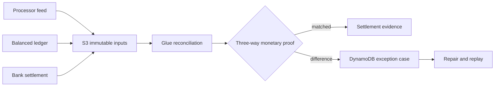

# LedgerGuard — Payment Reconciliation Platform

[](https://github.com/bhuvaneshwaranmurugan21/ledgerguard-payment-reconciliation-platform/actions/workflows/ci.yml)

LedgerGuard reconciles three independent financial truths: payment-processor events, balanced
internal journals, and bank settlements. It never calls equal row counts a settlement proof.



## Correctness demonstrated locally

- integer minor-unit money and currency contracts;
- immutable feed and journal identities;
- balanced double-entry journal validation;
- one-to-many settlement matching by explicit aggregation;
- missing-settlement detection and auditable exception-to-match transition;
- reversal-reference validation;
- atomic feed rollback and deterministic replay evidence.

The Terraform topology is production-shaped but no managed-runtime claim is made until the
repository contains real Step Functions, Glue, Athena, CloudWatch, cost, and teardown evidence.

```bash
python -m venv .venv
source .venv/bin/activate
python -m pip install -e '.[dev]'
make check
make evidence
```

