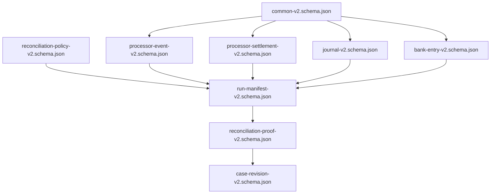

# Active architecture

## System responsibility

LedgerGuard keeps three financial truths independent and creates a versioned reconciliation proof.
It does not mutate source records to make them agree.

The financial meaning is frozen in
[`financial-semantics-v1.json`](../spec/financial-semantics-v1.json) and encoded by the active
[`v2` contract set](../contracts/active-contract-set-v1.json). Contract validation does not claim an
implemented reconciliation runtime.

These nine filenames are the exact active registry entries; the registry binds each filename to its
contract ID, version and digest. The diagram is a contract flow, not a runtime-execution claim.

## Transaction grain

The transaction key is processor, merchant, payment, event class, and currency. Processor activity
is compared with the movement of explicitly relevant ledger account roles. A balanced journal is
necessary but not sufficient: a journal can balance while posting the wrong accounts or amount.
The canonical identifier uses the `txn:` namespace plus a digest of the structured key, while the
inspectable key components remain in the proof.

## Settlement grain

The settlement key is processor, merchant, settlement identifier, settlement cycle, and currency.
Processor gross activity and explicit deductions produce expected net settlement. That value is
compared with clearing-account movement and one or more bank entries. Bank records need not carry a
payment identifier.
Allocation is exact-reference only; equal amount or nearby date cannot create a match. The
settlement proof preserves processor-ledger, processor-bank, and ledger-bank deltas independently.

## Planned managed components

| Component | Responsibility |
|---|---|
| Versioned Amazon S3 | Run-scoped heterogeneous inputs, manifests, Parquet outputs, and evidence |
| AWS Step Functions | Admission, synchronous processing, independent verification, and finalization |
| AWS Glue 5.1 | Spark 3.5.6 normalization and two-grain reconciliation |
| Amazon Athena | Independent count and monetary-total verification |
| Amazon DynamoDB | Conditional run identity and immutable case revisions |
| Amazon CloudWatch | Curated correctness, throughput, skew, utilization, and recovery signals |
| Terraform | Minimal bounded infrastructure and exact teardown |

## Frozen AWS target

| Target field | Value |
|---|---|
| Repository | `bhuvaneshwaranmurugan21/ledgerguard-payment-reconciliation-platform` |
| Default branch | `main` |
| AWS account ID | `857229544428` |
| AWS region | `ap-southeast-2` |
| OIDC role name | `LedgerGuardGitHubOidcRole` |
| AWS Glue version | `5.1` |
| Apache Spark version | `3.5.6` |
| Python version | `3.11` |

The table is checked against [the single target authority](../.github/ledgerguard-target.json).
It specifies a future managed boundary; it is not evidence of deployment or reconciliation.

The managed design remains `DESIGNED/MODELED` until Parts 3 and 4 produce attributable AWS
evidence.

## Storage decision

Part 1 selects run-scoped Parquet proofs rather than Iceberg. The project publishes immutable
reconciliation revisions and does not require mutable analytical tables, row-level updates, or time
travel supplied by a table format. Adding Iceberg would duplicate another platform's architecture
without solving a LedgerGuard requirement.

## Atomicity boundary

Exactly-once delivery is not claimed. The target guarantee is:

- immutable source identity;
- idempotent identical replay;
- conflict rejection for changed content;
- no authoritative partial proof;
- conditional run finalization; and
- new immutable revisions for late or corrected data.

The Part 2 implementation must define the local commit boundary. Part 3 must reproduce it using
managed storage and conditional control state.
