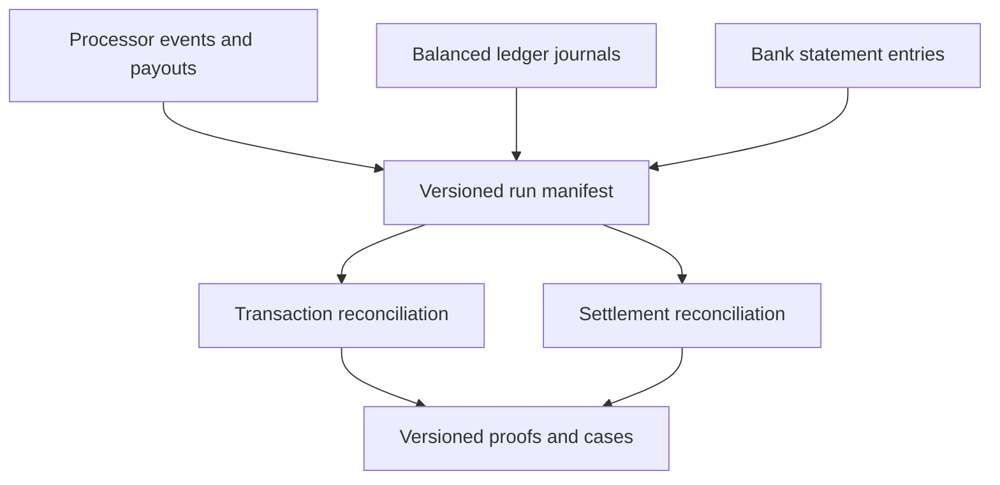

# Architecture

## System responsibility

LedgerGuard keeps three financial truths independent and creates a versioned reconciliation proof.
It does not mutate source records to make them agree.

## Transaction grain

The transaction key is processor, merchant, payment, event class, and currency. Processor activity
is compared with the movement of explicitly relevant ledger account roles. A balanced journal is
necessary but not sufficient: a journal can balance while posting the wrong accounts or amount.

## Settlement grain

The settlement key is processor, merchant, settlement identifier, settlement cycle, and currency.
Processor gross activity and explicit deductions produce expected net settlement. That value is
compared with clearing-account movement and one or more bank entries. Bank records need not carry a
payment identifier.

## Planned managed components

| Component | Responsibility |
|---|---|
| Versioned Amazon S3 | Run-scoped heterogeneous inputs, manifests, Parquet outputs, and evidence |
| AWS Step Functions | Admission, synchronous processing, independent verification, and finalization |
| AWS Glue 5.1 | Spark 3.5.6 normalization and two-grain reconciliation |
| Amazon Athena | Independent count and monetary-total verification |
| Amazon DynamoDB | Conditional run identity and immutable case revisions |
| Amazon CloudWatch | Curated correctness, throughput, skew, utilization, and recovery signals |
| Terraform | Minimal bounded infrastructure and exact teardown |

The managed design remains `DESIGNED/MODELED` until Parts 3 and 4 produce attributable AWS
evidence.

## Storage decision

Part 1 selects run-scoped Parquet proofs rather than Iceberg. The project publishes immutable
reconciliation revisions and does not require mutable analytical tables, row-level updates, or time
travel supplied by a table format. Adding Iceberg would duplicate another platform's architecture
without solving a LedgerGuard requirement.

## Atomicity boundary

Exactly-once delivery is not claimed. The target guarantee is:

- immutable source identity;
- idempotent identical replay;
- conflict rejection for changed content;
- no authoritative partial proof;
- conditional run finalization; and
- new immutable revisions for late or corrected data.

The Part 2 implementation must define the local commit boundary. Part 3 must reproduce it using
managed storage and conditional control state.
